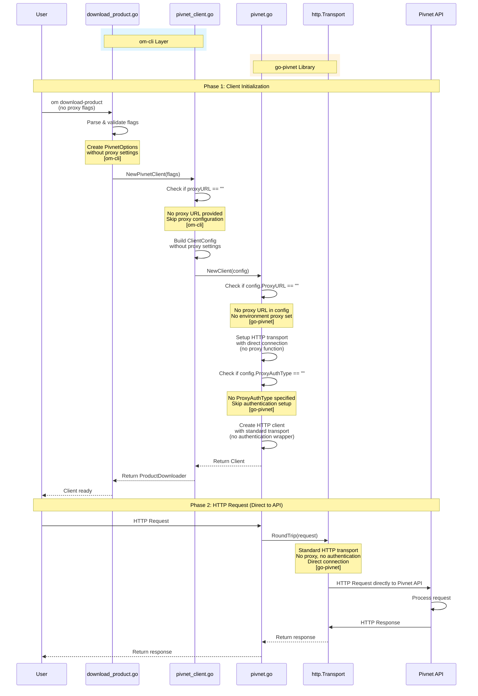
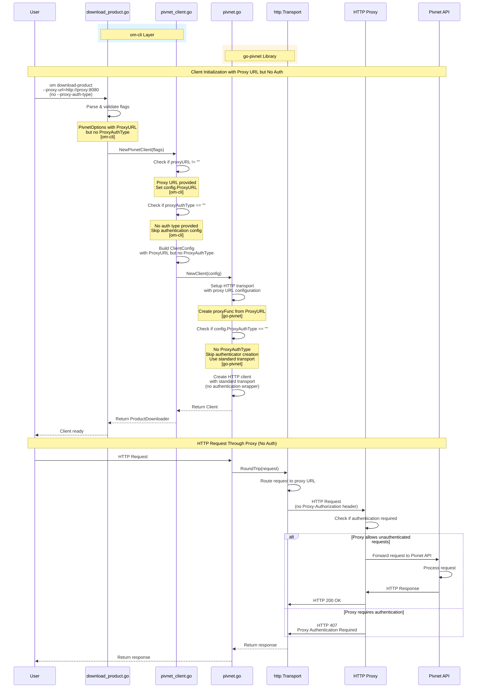
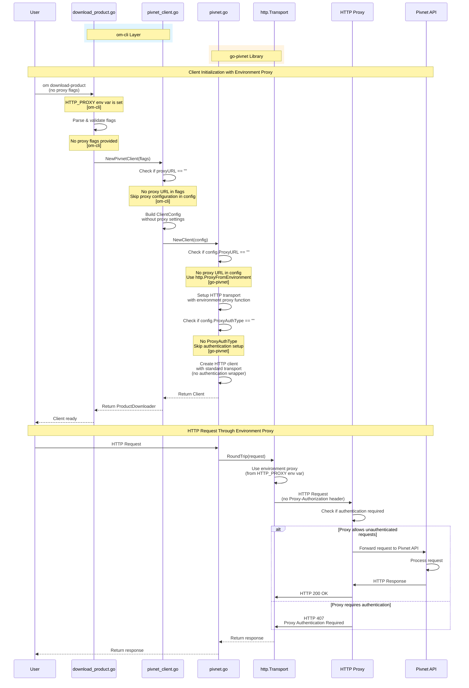

# No Proxy Authentication Flow - Complete Sequence Diagram

This document provides a comprehensive sequence diagram demonstrating the flow when no proxy authentication is required or configured, showing how om-cli and go-pivnet handle requests without proxy authentication.

## Architecture Overview

The proxy authentication solution involves changes in **both om-cli and go-pivnet library**:

### om-cli Changes
- **Command Layer** (`commands/download_product.go`): Added command-line flags for proxy authentication parameters:
  - `--proxy-url`: Proxy server URL
  - `--proxy-username`: Username for proxy authentication
  - `--proxy-password`: Password for proxy authentication
  - `--proxy-auth-type`: Type of authentication (basic, spnego)
  - `--proxy-krb5-config`: Path to Kerberos config file (for SPNEGO)
- **Adapter Layer** (`download_clients/pivnet_client.go`): 
  - Receives proxy flags from command layer
  - Converts flags to `ClientConfig` structure
  - Implements explicit validation logic (only sets proxy if URL provided)
  - Passes configuration to go-pivnet library

### go-pivnet Library Changes
- **Client Factory** (`pivnet.go`): 
  - Extended `ClientConfig` to include proxy authentication fields
  - Creates proxy function from `ProxyURL`
  - Conditionally wraps transport with authentication based on `ProxyAuthType`
- **Authentication Components**:
  - `proxy_authenticator.go`: Factory for creating authenticators
  - `proxy_auth_basic.go`: Basic authentication implementation
  - `proxy_auth_spnego.go`: SPNEGO/Kerberos authentication implementation
  - `proxy_auth.go`: Transport wrapper that adds authentication headers

### Interface Boundary
The interface between om-cli and go-pivnet is the `ClientConfig` structure, which is populated by om-cli and consumed by go-pivnet. This separation allows:
- om-cli to handle user-facing concerns (flag parsing, validation)
- go-pivnet to handle authentication logic (token generation, header management)

## Overview

The no proxy authentication flow occurs when:
1. **No proxy flags provided**: User doesn't specify proxy-related flags
2. **Proxy URL without auth**: Proxy URL is provided but no authentication type is specified
3. **Environment proxy**: Proxy is configured via environment variables without authentication

This flow involves multiple layers:
1. **om-cli Layer**: Command parsing, flag validation, and client creation
2. **go-pivnet Library Layer**: Client initialization with standard transport (no authentication wrapper)
3. **External Services**: HTTP Proxy (optional, if configured) and Pivnet API

## Complete No Proxy Authentication Flow

### Mermaid Sequence Diagram: No Proxy (Direct Connection)



## Alternative Flow 1: Proxy URL Provided Without Authentication



## Alternative Flow 2: Environment Proxy (No Authentication)



## Component Summary

This sequence diagram demonstrates the interaction of the following components:

### om-cli Components
1. **commands/download_product.go**: Command-line interface, flag parsing, validation
2. **download_clients/pivnet_client.go**: Adapter layer, converts flags to ClientConfig

### go-pivnet Library Components
1. **pivnet.go (NewClient)**: Client factory, transport setup
2. **http.Transport**: Standard Go HTTP transport (no authentication wrapper)

### External Services
1. **HTTP Proxy**: Optional proxy server (may or may not require authentication)
2. **Pivnet API**: Target API for product downloads

## Key Phases

### Phase 1: Client Initialization (Steps 1-15)
- User provides command without proxy authentication flags
- om-cli parses flags and creates ClientConfig without proxy auth settings
- Explicit validation: Only set proxy config if URL provided AND auth type specified
- go-pivnet creates standard HTTP transport (no authentication wrapper)
- Client is ready for use

### Phase 2: HTTP Request (Steps 16-28)
- HTTP request is initiated
- Request is sent through standard transport (no authentication headers)
- If proxy is configured, request goes through proxy without Proxy-Authorization header
- Proxy may accept or reject based on its configuration
- Response is returned to user

## Key Behaviors

### Explicit Validation Logic

The om-cli adapter layer includes explicit validation:

```go
// Only configure proxy settings if proxy URL is provided
if proxyURL != "" {
    config.ProxyURL = proxyURL
    
    // Set proxy authentication if auth type is provided
    if proxyAuthType != "" {
        // Configure authentication...
    }
    // If no auth type, proxy URL is set but no authentication configured
}
```

This ensures:
- **No proxy flags**: Client created normally, uses environment proxy or direct connection
- **Proxy URL only**: Proxy is configured but no authentication is added
- **Proxy URL + Auth Type**: Full proxy authentication is configured

### Transport Selection

1. **No ProxyAuthType**: Standard `http.Transport` is used
   - May use `http.ProxyFromEnvironment()` if no explicit proxy URL
   - No authentication wrapper is applied

2. **ProxyAuthType specified**: `ProxyAuthTransport` wraps the base transport
   - Adds authentication headers to requests
   - Handles authentication logic

## Comparison with Authentication Flows

| Aspect | No Authentication | Basic Authentication | SPNEGO Authentication |
|--------|------------------|---------------------|----------------------|
| **Setup Complexity** | Simplest | Simple | Complex |
| **External Services** | None | None | Requires Kerberos KDC |
| **Request Headers** | None | Proxy-Authorization: Basic | Proxy-Authorization: Negotiate |
| **Performance** | Fastest | Fast | Slower (KDC calls) |
| **Use Case** | Public proxy or no proxy | Simple authenticated proxy | Enterprise Kerberos proxy |

## Error Handling

The sequence diagram shows the happy path. In practice, errors can occur at various points:

- **Proxy Requires Authentication**: If proxy is configured but requires auth, returns HTTP 407
- **Network Errors**: Connection failures to proxy or Pivnet API
- **Invalid Proxy URL**: If proxy URL is malformed, connection may fail
- **Environment Proxy Issues**: If environment proxy is misconfigured, requests may fail

## Common Scenarios

### Scenario 1: No Proxy Configuration (Direct Connection)
- User doesn't provide any proxy flags
- No `HTTP_PROXY` or `HTTPS_PROXY` environment variables set
- Client connects directly to Pivnet API
- No proxy involved in the flow
- **This is the simplest and fastest scenario**

### Scenario 2: Environment Proxy (No Auth)
- User doesn't provide proxy flags
- `HTTP_PROXY` or `HTTPS_PROXY` environment variables are set
- Client uses environment proxy without authentication
- Proxy may or may not require authentication (depends on proxy configuration)
- **Uses Go's standard `http.ProxyFromEnvironment()` function**

### Scenario 3: Explicit Proxy URL (No Auth)
- User provides `--proxy-url` but no `--proxy-auth-type`
- Client routes requests through specified proxy
- No authentication headers are added
- Proxy may accept or reject based on its configuration
- **Explicit proxy configuration without authentication**

## Related Documentation

- [BASIC_AUTHENTICATION_FLOW.md](./BASIC_AUTHENTICATION_FLOW.md) - Basic authentication flow
- [SPNEGO_AUTHENTICATION_FLOW.md](./SPNEGO_AUTHENTICATION_FLOW.md) - SPNEGO authentication flow
- [PROXY_AUTHENTICATION_LOW_LEVEL_DESIGN.md](./PROXY_AUTHENTICATION_LOW_LEVEL_DESIGN.md) - Detailed low-level design
- [PROXY_AUTHENTICATION.md](./PROXY_AUTHENTICATION.md) - High-level overview
- [PROXY_AUTHENTICATION_QUICK_REFERENCE.md](./PROXY_AUTHENTICATION_QUICK_REFERENCE.md) - Quick reference guide

