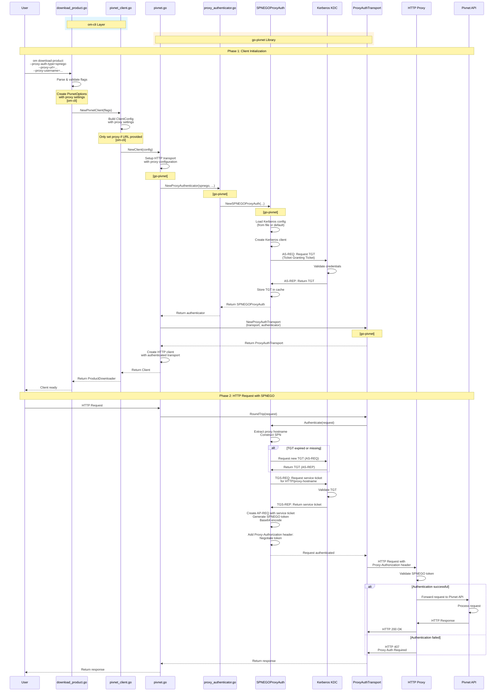

# SPNEGO Authentication Flow - Complete Sequence Diagram

This document provides a comprehensive sequence diagram demonstrating the complete SPNEGO (Kerberos) proxy authentication flow, touching all components from user input through om-cli, go-pivnet library, and external services.

## Architecture Overview

The proxy authentication solution involves changes in **both om-cli and go-pivnet library**:

### om-cli Changes
- **Command Layer** (`commands/download_product.go`): Added command-line flags including `--proxy-krb5-config` for Kerberos configuration
- **Adapter Layer** (`download_clients/pivnet_client.go`): Converts flags to `ClientConfig` and passes to go-pivnet

### go-pivnet Library Changes
- **Client Factory** (`pivnet.go`): Extended `ClientConfig` and conditionally wraps transport with authentication
- **Authentication Components**: `proxy_authenticator.go`, `proxy_auth_spnego.go`, `proxy_auth.go` implement SPNEGO/Kerberos authentication
- **Kerberos Integration**: Uses `gokrb5` library for Kerberos protocol interactions

### Interface Boundary
The interface between om-cli and go-pivnet is the `ClientConfig` structure, which is populated by om-cli and consumed by go-pivnet.

## Overview

The SPNEGO authentication flow involves multiple layers:
1. **om-cli Layer**: Command parsing, flag validation, and client creation
2. **go-pivnet Library Layer**: Client initialization, authenticator creation, and transport setup
3. **External Services**: Kerberos KDC for ticket acquisition and HTTP Proxy for request forwarding

## Complete SPNEGO Authentication Flow

### Mermaid Sequence Diagram (Simplified)

## Component Summary

This sequence diagram demonstrates the interaction of the following components:

### om-cli Components
1. **commands/download_product.go**: Command-line interface, flag parsing, validation
2. **download_clients/pivnet_client.go**: Adapter layer, converts flags to ClientConfig

### go-pivnet Library Components
1. **pivnet.go (NewClient)**: Client factory, transport setup
2. **proxy_authenticator.go (NewProxyAuthenticator)**: Factory for creating authenticators
3. **proxy_auth_spnego.go (SPNEGOProxyAuth)**: SPNEGO authentication implementation
4. **proxy_auth.go (ProxyAuthTransport)**: Transport wrapper that adds authentication

### External Libraries
1. **gokrb5**: Kerberos client library for ticket management
2. **http.Transport**: Go standard library HTTP transport
3. **http.Client**: Go standard library HTTP client

### External Services
1. **Kerberos KDC**: Key Distribution Center for ticket issuance
2. **HTTP Proxy**: Enterprise proxy server requiring authentication
3. **Pivnet API**: Target API for product downloads

## Key Phases

### Phase 1: Client Initialization (Steps 1-10)
- User provides SPNEGO authentication parameters via CLI flags
- om-cli parses flags and creates ClientConfig
- go-pivnet creates SPNEGO authenticator
- Authenticator acquires TGT from Kerberos KDC
- Transport is wrapped with authenticator
- Client is ready for use

### Phase 2: HTTP Request (Steps 11-21)
- HTTP request is initiated
- SPNEGO token is generated (may require new TGT or service ticket from KDC)
- Request is sent to proxy with Proxy-Authorization header
- Proxy validates SPNEGO token and forwards to Pivnet API (if successful)
- Response is returned to user

## Authentication Flow Details

### Kerberos Protocol Steps
1. **AS-REQ/AS-REP**: Initial authentication to get TGT (Ticket Granting Ticket)
2. **TGS-REQ/TGS-REP**: Request service ticket for HTTP/proxy-hostname
3. **AP-REQ**: Create application request with service ticket
4. **SPNEGO Token**: Wrap AP-REQ in SPNEGO structure and encode

### SPNEGO Token Structure
- Base64-encoded ASN.1 structure
- Contains AP-REQ with service ticket
- Sent in Proxy-Authorization header: `Negotiate <base64-token>`

## Error Handling

The sequence diagram shows the happy path. In practice, errors can occur at various points:

- **Kerberos Authentication Failure**: If credentials are invalid, KDC returns error
- **TGT Expiration**: TGT may expire, requiring re-authentication
- **Service Ticket Failure**: If service ticket cannot be obtained, authentication fails
- **Proxy Authentication Failure**: Proxy returns HTTP 407 if SPNEGO token is invalid
- **Network Errors**: Connection failures to KDC, proxy, or Pivnet API

## Related Documentation

- [PROXY_AUTHENTICATION_LOW_LEVEL_DESIGN.md](./PROXY_AUTHENTICATION_LOW_LEVEL_DESIGN.md) - Detailed low-level design
- [PROXY_AUTHENTICATION.md](./PROXY_AUTHENTICATION.md) - High-level overview
- [PROXY_AUTHENTICATION_QUICK_REFERENCE.md](./PROXY_AUTHENTICATION_QUICK_REFERENCE.md) - Quick reference guide

